# 🌾 SafraPLUS - Gestão Financeira para Produtores Rurais
O SafraPLUS é um sistema web para gerenciamento financeiro de safras e de estoque focado no produtor rural. Ele permite o registro detalhado de custos e receitas, vinculando-os obrigatoriamente a um ciclo produtivo (safra) para o cálculo preciso da lucratividade.

Este projeto foi desenvolvido como um trabalho acadêmico.

# ✨ Funcionalidades Principais
O sistema foi construído com uma arquitetura multi-usuário que separa as permissões em dois níveis:

**1. Funções do Produtor (Usuário Comum)**

* **Gestão de Safras**: CRUD (Criar, Ler, Atualizar, Deletar) dos ciclos produtivos (ex: Soja 2024/2025, Milho).
* **Gestão Financeira**: Lançamento de todas as Receitas (vendas) e Custos (despesas), obrigatoriamente vinculados a uma safra específica.
* **Controle de Estoque**: Gestão de Insumos (CRUD) com movimentação de "Entrada por Compra" e "Saída para Uso", que atualiza o saldo do inventário automaticamente .
* **Cadastros de Apoio**: CRUD de recursos próprios, incluindo Maquinários, Mão de Obra e Categorias Financeiras.
* **Gestão de Custos Operacionais**: CRUD de custos de maquinário (ex: combustível) e mão de obra (ex: diárias), também vinculados a uma safra.
* **Gerenciamento de Perfil**: Permite ao produtor editar seus próprios dados pessoais, alterar sua senha e excluir sua própria conta.

**2. Funções do Administrador (Admin)**
O Admin possui todas as funções do Produtor e, adicionalmente:

* **Gestão de Produtores**: CRUD de todas as contas de Produtores (usuários comuns) do sistema.
* **Gestão de Administradores**: CRUD de outras contas de Administradores .
* **Visão Consolidada**: Acesso a relatórios e painéis que exibem os dados de todos os produtores cadastrados no sistema .

**3. Relatórios e Dashboard**
* **Painel de Gestão**: KPIs visuais de Receitas Totais, Despesas Totais e Saldo Atual.
* **Relatórios Gerenciais**: Uma tela dedicada que calcula e exibe automaticamente:
    * **Tabela de Lucratividade Consolidada por Safra (Lucro/Prejuízo)**.
    * **Gráfico de Distribuição de Custos por Categoria (Gráfico de Pizza)**.
    * **Gráfico de Fluxo de Caixa (Gráfico de Linha)**.
    * **KPI**: Análise de Custo por Hectare.

# 🛠️ Tecnologias Utilizadas
* **Backend**: Laravel (PHP)
* **Frontend**: Blade (HTML), Bootstrap 5, Chart.js (para os gráficos de relatórios)
* **Banco de Dados**: MySQL
* **Autenticação**: Laravel Breeze (para Login, Registro e Gerenciamento de Perfil)
* **Controle de Versão**: Git & GitHub

# 📷 Telas do Sistema
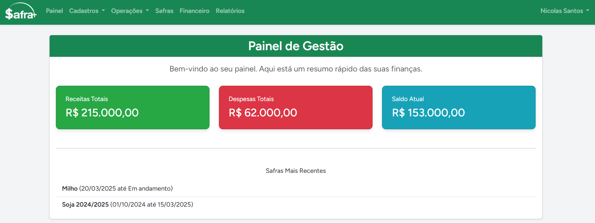
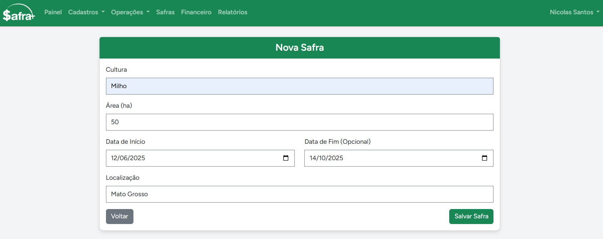
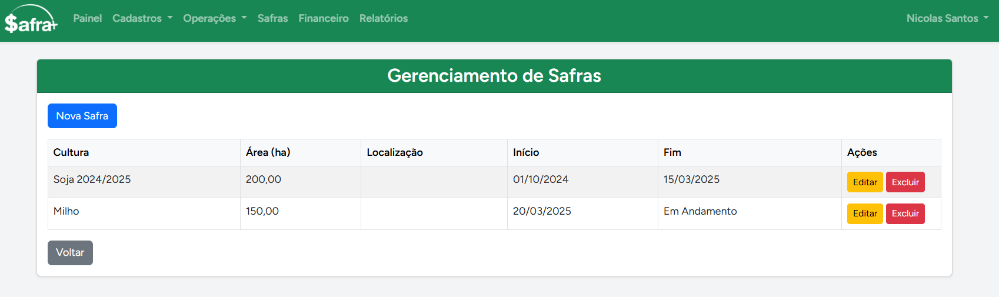
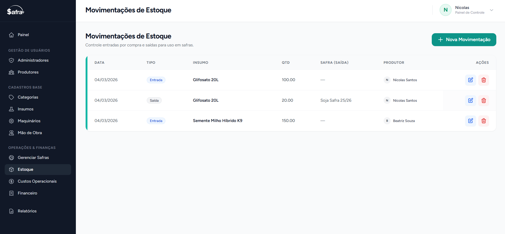
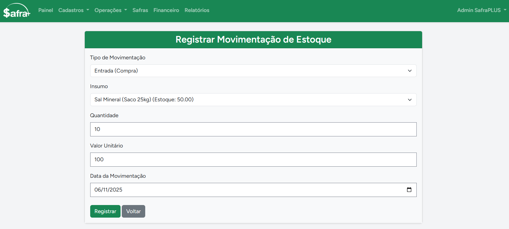
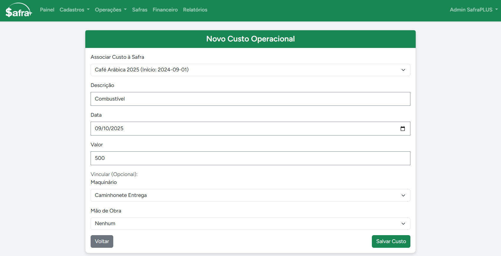
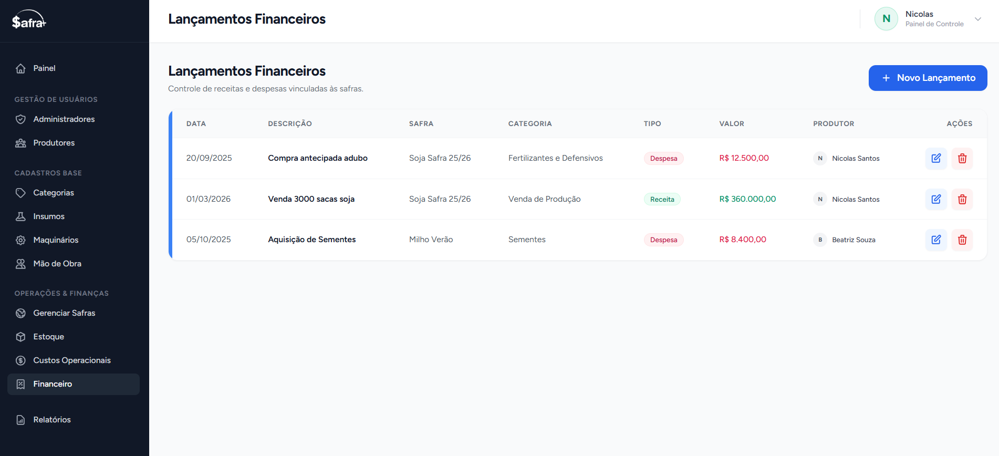
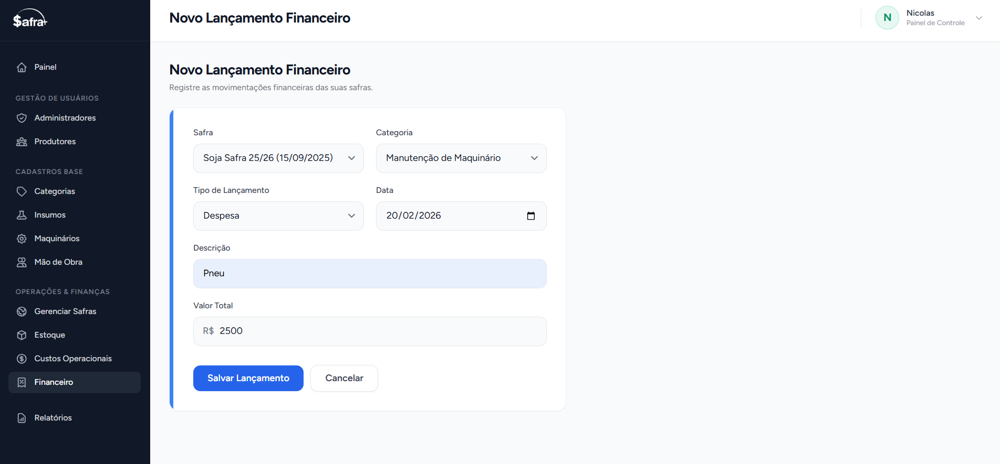
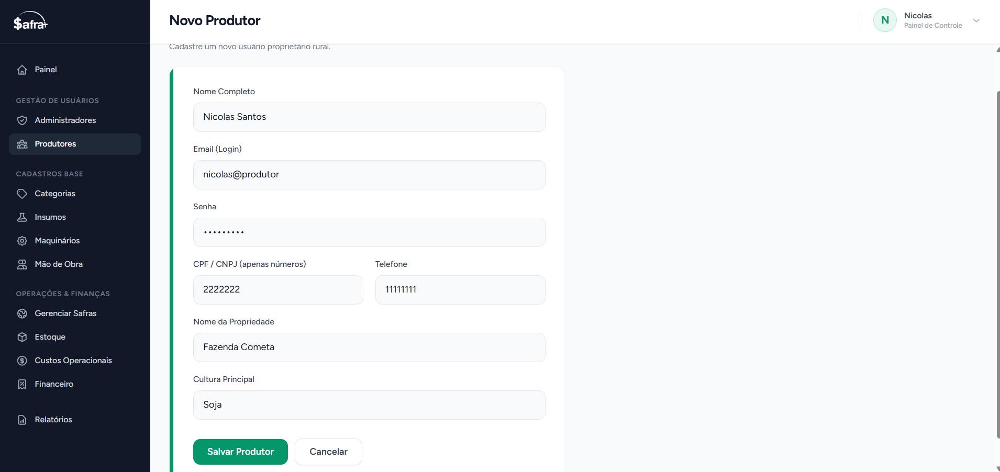
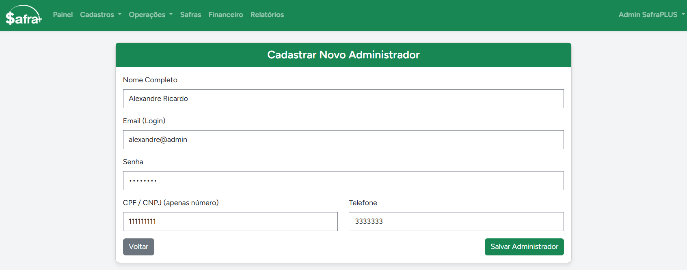
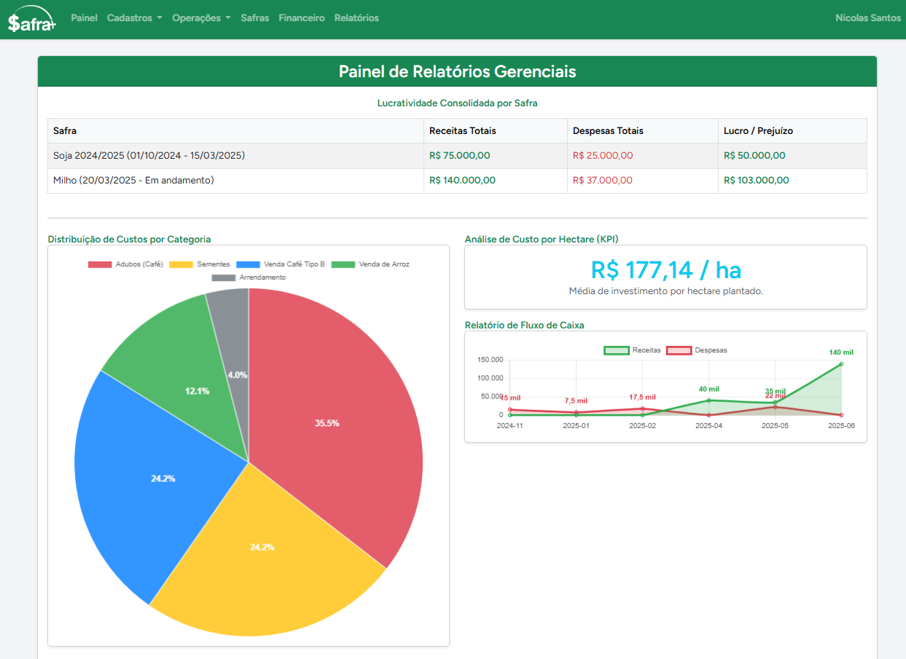
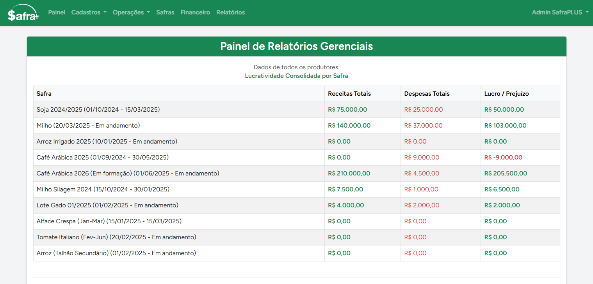
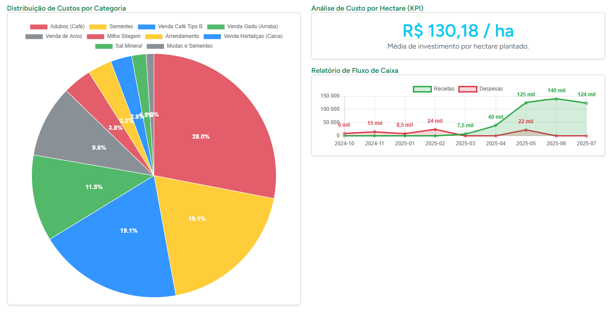
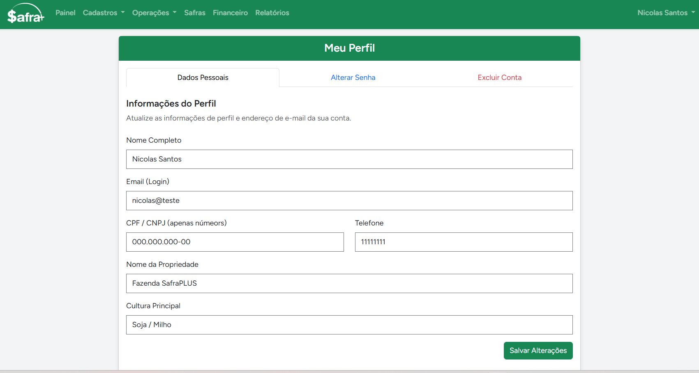
